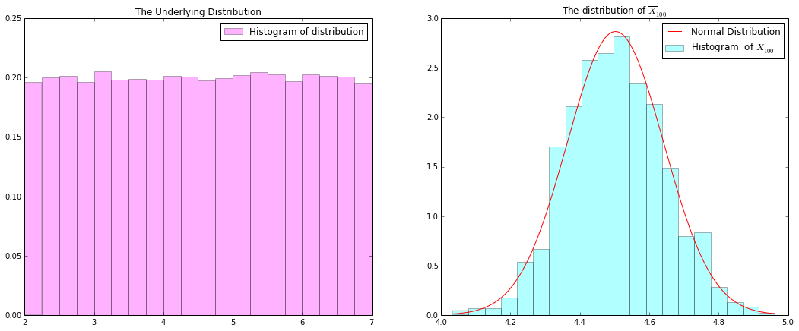
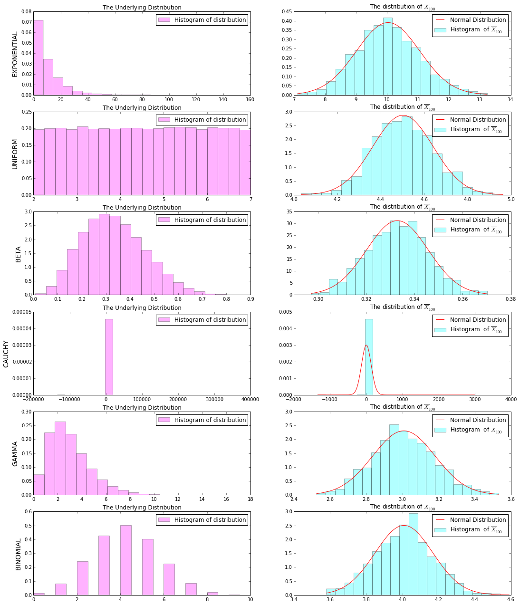
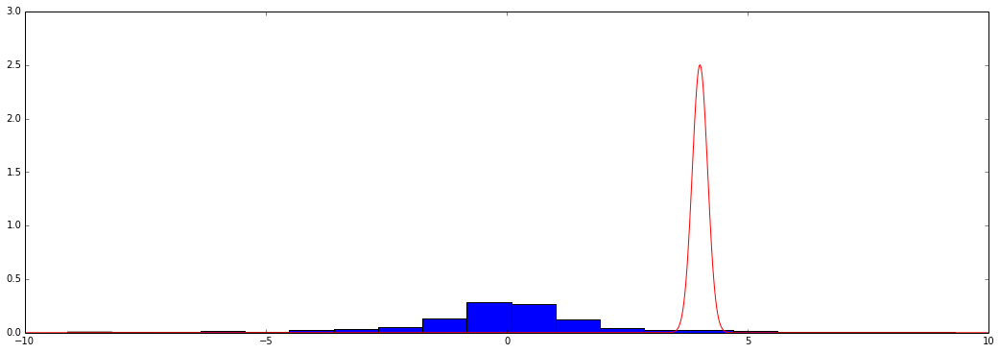
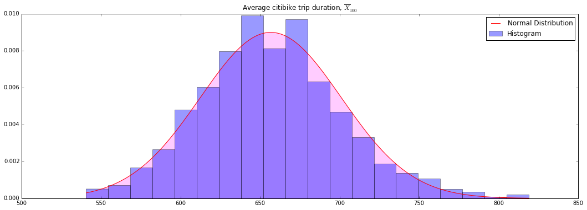
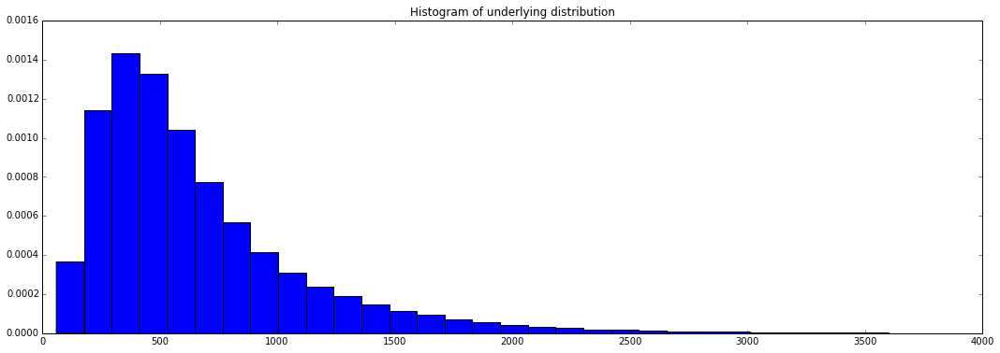

We are going to be demonstrating the central limit theorem, both with randomly generated data and with real world data.

## Central Limit Theorem

Let $X_1,...,X_n$ be idd with mean $\mu$ and variance $\sigma^2$.  Let $\overline{X}_n = \frac{1}{n} \sum_{i=1}^n {X_i}$.  Then

$$ Z_n = \frac{\overline{X}_n - \mu}{\sqrt{\text{V}(\overline{X}_n)}} = \frac{\sqrt{n}(\overline{X}_n - \mu)}{\sigma} \rightarrow Z \sim N(0,1)$$


```python
%pylab inline
import pandas as pd
import numpy as np
from numpy.random import standard_cauchy
```

    Populating the interactive namespace from numpy and matplotlib


```python
n = 100
sample_size = 1000
_size = [sample_size, n]

distributions = {
    "UNIFORM": uniform(2, 7, size=_size),
    "BINOMIAL": binomial(10, 0.4, size=_size),
    "EXPONENTIAL": exponential(10, size=_size),
    "GAMMA": gamma(3, 1, size=_size),
    "BETA": beta(4, 8, size=_size),
    "CAUCHY": standard_cauchy(size=_size)
}

# Cleaner way to define a single set of samples.  The dictionary above is for graphing later.
# samples = uniform(2, 7, size=_size)
# samples = binomial(10, 0.4, size=_size)
# samples = exponential(10, size=_size)
# samples = gamma(3, 1, size=_size)
# samples = beta(4, 8, size=_size)
# samples = standard_cauchy(size=_size)

samples = distributions["UNIFORM"]

sample_mu = mean(samples)
sample_s2 = var(samples)

x_bars = samples.sum(axis=1)/float(n)
mu = mean(x_bars)
s2 = var(x_bars)

print "\nThe underlying distribution samples have mean: %f and variance: %f" % (sample_mu, sample_s2)
print "The x bar statistic with n=%d has mean: %f and variance: %f\n" % (n, mu, s2)
print "Variance of x bar: %f, Var(X)/n: %f\n" % (s2, sample_s2/n)
```

    
    The underlying distribution samples have mean: 4.502724 and variance: 2.076698
    The x bar statistic with n=100 has mean: 4.502724 and variance: 0.019366
    
    Variance of x bar: 0.019366, Var(X)/n: 0.020767
    


```python
figsize(18, 7)
subplot(121)
_flattened = samples.flatten()
_ = hist(_flattened, normed=True, bins=20, alpha=0.3, color='magenta', label="Histogram of distribution")
title("The Underlying Distribution")
legend()

subplot(122)
_ = hist(x_bars, normed=True, bins=20, alpha=0.3, color='cyan', label=r"Histogram  of $\overline{X}_{%d}$" % n)

X = linspace(min(x_bars), max(x_bars), 1000)
Y = 1.0 / sqrt(2*pi*s2) * e**(-(X-mu)**2 / (2*s2))
plot(X, Y, 'r-', label="Normal Distribution")
title(r"The distribution of $\overline{X}_{%d}$" % n)
legend()
```


    <matplotlib.legend.Legend at 0x10e0657d0>





####If we want to graph a bunch at once we can loop through them.  Even better is to abstract the general parts and write a function


```python
figsize(18, 22)
num_charts = len(distributions)
i = 0

for k in distributions:

    samples = distributions[k]
    x_bars = samples.sum(axis=1)/float(n)
    mu = mean(x_bars)
    s2 = var(x_bars)
    
    subplot(num_charts, 2, (2*i+1))
    _flattened = samples.flatten()
    _ = hist(_flattened, normed=True, bins=20, alpha=0.3, color='magenta', label="Histogram of distribution")
    title("The Underlying Distribution")
    legend()
    ylabel(k, size=14)
    ticklabel_format(style='plain')

    subplot(num_charts, 2, (2*i+2))
    _ = hist(x_bars, normed=True, bins=20, alpha=0.3, color='cyan', label=r"Histogram  of $\overline{X}_{%d}$" % n)

    X = linspace(min(x_bars), max(x_bars), 1000)
    Y = 1.0 / sqrt(2*pi*s2) * e**(-(X-mu)**2 / (2*s2))
    plot(X, Y, 'r-', label="Normal Distribution")
    title(r"The distribution of $\overline{X}_{%d}$" % n)
    legend()
    
    i +=1
    
```





##Uh Oh...
One of these things is not like the others.  What happened?

Let's look a little closer at the cauchy distribution


```python
figsize(18, 6)
x_bars = distributions['CAUCHY'].sum(axis=1)/float(n)
bound = 10
window = [x for x in x_bars if -bound <= x <= bound]
_ = hist(window, normed=True, bins=20)

X = linspace(-bound, bound, 1000)
Y = 1.0 / sqrt(2*pi*s2) * e**(-(X-mu)**2 / (2*s2))
plot(X, Y, 'r-')
```


    [<matplotlib.lines.Line2D at 0x10ed07d50>]





#Using Collected Data
Now let's load up our Citibike ridership data.


```python
df = pd.read_csv('201412-citibike-tripdata.csv')
df.head(2)
```


<div style="max-height:1000px;max-width:1500px;overflow:auto;">
<table border="1" class="dataframe">
  <thead>
    <tr style="text-align: right;">
      <th></th>
      <th>tripduration</th>
      <th>starttime</th>
      <th>stoptime</th>
      <th>start station id</th>
      <th>start station name</th>
      <th>start station latitude</th>
      <th>start station longitude</th>
      <th>end station id</th>
      <th>end station name</th>
      <th>end station latitude</th>
      <th>end station longitude</th>
      <th>bikeid</th>
      <th>usertype</th>
      <th>birth year</th>
      <th>gender</th>
    </tr>
  </thead>
  <tbody>
    <tr>
      <th>0</th>
      <td> 1257</td>
      <td> 12/1/2014 00:00:28</td>
      <td> 12/1/2014 00:21:25</td>
      <td> 475</td>
      <td> E 16 St &amp; Irving Pl</td>
      <td> 40.735243</td>
      <td>-73.987586</td>
      <td> 521</td>
      <td>      8 Ave &amp; W 31 St</td>
      <td> 40.750450</td>
      <td>-73.994811</td>
      <td> 16047</td>
      <td>   Customer</td>
      <td>  NaN</td>
      <td> 0</td>
    </tr>
    <tr>
      <th>1</th>
      <td>  275</td>
      <td> 12/1/2014 00:00:43</td>
      <td> 12/1/2014 00:05:18</td>
      <td> 498</td>
      <td>  Broadway &amp; W 32 St</td>
      <td> 40.748549</td>
      <td>-73.988084</td>
      <td> 546</td>
      <td> E 30 St &amp; Park Ave S</td>
      <td> 40.744449</td>
      <td>-73.983035</td>
      <td> 18472</td>
      <td> Subscriber</td>
      <td> 1988</td>
      <td> 2</td>
    </tr>
  </tbody>
</table>
<p>2 rows × 15 columns</p>
</div>


```python
from random import sample

print df.tripduration.describe(percentile_width=99)

# The citibike data seems pretty dirty, so I am using domain knowledge
# to clean up the dataset.

df_clean = df[df.tripduration < 60*60*1]
# Why am I justified in doing this?  Am I justified?  Am I just doing
# arbitrary nonsense so my graphs will come out the way I want?

n = 100
sample_size = 1000

data = []
for i in range(sample_size):
    data.append(df_clean.loc[sample(df_clean.index, n)]['tripduration'].mean())
    
_ = hist(data, bins=20, normed=True, alpha=0.4, label="Histogram")

# Calculation
mu = mean(data)
s2 = var(data)
X = linspace(min(data), max(data), 1000)
Y = 1.0 / sqrt(2*pi*s2) * e**(-(X-mu)**2 / (2*s2))

# Graphing
plot(X, Y, 'r-', label="Normal Distribution")
fill_between(X, Y, alpha=0.2, color='magenta', label="Normal Distribution")
title(r"Average citibike trip duration, $\overline{X}_{%d}$" % n)
legend()

```

    count    399069.000000
    mean        745.757849
    std        2712.153053
    min          60.000000
    0.5%         98.000000
    50%         531.000000
    99.5%      4302.660000
    max      732149.000000
    Name: tripduration, dtype: float64


    <matplotlib.legend.Legend at 0x10ca59cd0>





```python
_ = hist(df_clean.tripduration, bins=30, normed=True)
title("Histogram of underlying distribution")
```


    <matplotlib.text.Text at 0x10ec49f90>




