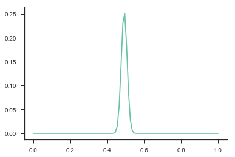
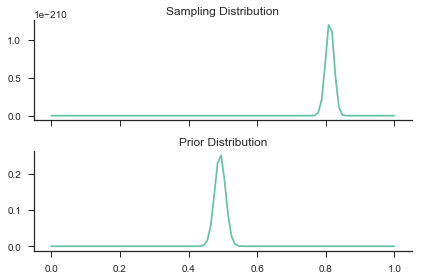
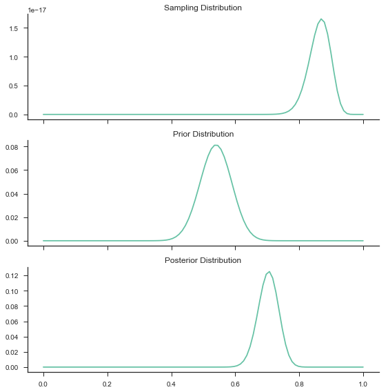
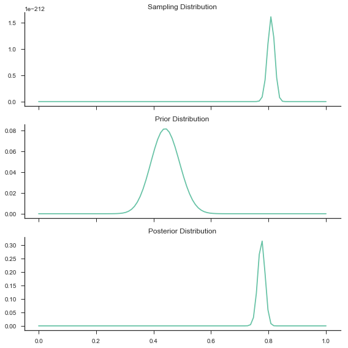

```python
import numpy as np

data_coin_flips = np.random.randint(2, size=1000)
np.mean(data_coin_flips)
```


    0.51000000000000001


```python
bernoulli_flips = np.random.binomial(n=1, p=.5, size=1000)
np.mean(bernoulli_flips)
```


    0.496


```python
def bern_pmf(x, p):
    if (x == 1):
        return p
    elif (x == 0):
        return (1-p)
    else:
        return "Value Not in Support of Distribution"
```


```python
print(bern_pmf(1, .5))
print(bern_pmf(0, .5)) 
```

    0.5
    0.5


```python
import scipy.stats as st
print(st.bernoulli.pmf(1, .5))
print(st.bernoulli.pmf(0, .5))
```

    0.5
    0.5


```python
import matplotlib.pyplot as plt
import seaborn as sns
%matplotlib inline

fair_flips = bernoulli_flips = np.random.binomial(n=1, p=.5, size=1000)
p_fair = np.array([np.product(st.bernoulli.pmf(fair_flips, p)) for p in params])
p_fair = p_fair / np.sum(p_fair)
plt.plot(params, p_fair)
sns.despine()
```





```python
unfair_flips = bernoulli_flips = np.random.binomial(n=1, p=.8, size=1000)
p_unfair = np.array([np.product(st.bernoulli.pmf(unfair_flips, p)) for p in params])
fig, axes = plt.subplots(2, 1, sharex=True)
axes[0].plot(params, p_unfair)
axes[0].set_title("Sampling Distribution")
axes[1].plot(params, p_fair)
axes[1].set_title("Prior Distribution")
sns.despine()
plt.tight_layout() 
```





By definition, we know that (If you don’t believe me, check out this page for a refresher):

$P(A|B) = \dfrac{P(A,B)}{P(B)}$ Or in English, the probability of seeing A given B is the probability of seeing them both divided by the probability of B.
$P(B|A) = \dfrac{P(A,B)}{P(A)}$ Or in English, the probability of seeing B given A is the probability of seeing them both divided by the probability of A.
You will notice that both of these values share the same numerator, so:

$P(A,B) = P(A|B)*P(B)$
$P(A,B) = P(A|B)*P(B)$
Thus:

$P(A|B)*P(B) = P(B|A)*P(A)$

Which implies:

$P(A|B) = \dfrac{P(B|A)*P(A)}{P(B)}$

And plug in $θ$ for $A$ and $X$ for $B$:

$P(\theta|X) = \dfrac{P(X|\theta)*P(\theta)}{P(X)}$

Nice! Now we can plug in some terminology we know:

$Posterior = \dfrac{likelihood * prior}{P(X)}$

But what is the $P(X)?$ Or in English, the probability of our data? That sounds weird… Let’s go back to some math and use B and A again:

We know that $P(B)=∑AP(A,B)$ (check out this page for a refresher)

And from our definitions above, we know that:

$P(A,B) = P(A|B)*P(A)$

Thus:

$P(B) = \sum_{A} P(A|B)*P(A)$

Plug in our $θ$ and $X$:

$P(X) = \sum_{\theta} P(\theta|X)*P(\theta)$

Plug in our terminology:

$P(X) = \sum_{\theta} likelihood * prior$

Wow! Isn’t that awesome! But what do we mean by $∑θ$. This means to sum over all the values of our parameters. In our coin flip example, we defined 100 values for our parameter p, so we would have to calculated the likelihood * prior for each of these values and sum all those anwers. That is our denominator for Bayes Theorem. Thus our final answer for Bayes is:

$Posterior = \dfrac{likelihood * prior}{\sum_{\theta} likelihood * prior}$

That was a lot of text. Let’s do some more coding and put everything together.


```python
def bern_post(n_params=100, n_sample=100, true_p=.8, prior_p=.5, n_prior=100):
    params = np.linspace(0, 1, n_params)
    sample = np.random.binomial(n=1, p=true_p, size=n_sample)
    likelihood = np.array([np.product(st.bernoulli.pmf(sample, p)) for p in params])
    #likelihood = likelihood / np.sum(likelihood)
    prior_sample = np.random.binomial(n=1, p=prior_p, size=n_prior)
    prior = np.array([np.product(st.bernoulli.pmf(prior_sample, p)) for p in params])
    prior = prior / np.sum(prior)
    posterior = [prior[i] * likelihood[i] for i in range(prior.shape[0])]
    posterior = posterior / np.sum(posterior)

    fig, axes = plt.subplots(3, 1, sharex=True, figsize=(8,8))
    axes[0].plot(params, likelihood)
    axes[0].set_title("Sampling Distribution")
    axes[1].plot(params, prior)
    axes[1].set_title("Prior Distribution")
    axes[2].plot(params, posterior)
    axes[2].set_title("Posterior Distribution")
    sns.despine()
    plt.tight_layout()

    return posterior
```


```python
example_post = bern_post()
```





```python
moredata_post = bern_post(n_sample=1000)
```





```python

```
