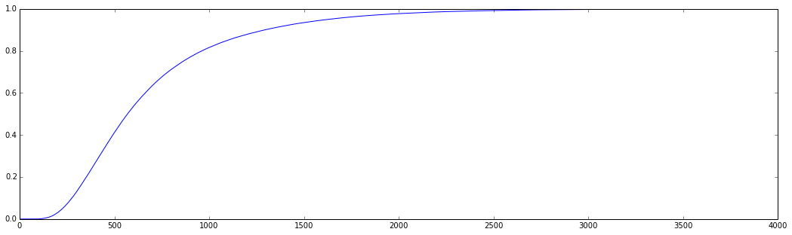
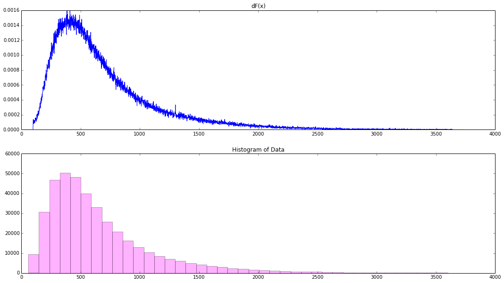

```python
%pylab inline
import pandas as pd
```

    Populating the interactive namespace from numpy and matplotlib


#The Empirical Distribution of Citibike Trip Durations
$$ \hat{F_n} = \frac{1}{n}\sum_{i=1}^n{I(X_i \leq x)} $$


```python
df = pd.read_csv('201412-citibike-tripdata.csv')
tripduration = df[df.tripduration < 60*60*1]['tripduration']
```


```python
total = float(tripduration.count())
def F(x):
    return tripduration[tripduration < x].count()/total
```


```python
Y = [F(y) for y in range(tripduration.min()-100, tripduration.max()+100)]
```


```python
figsize(18, 5)
plot(Y)
```


    [<matplotlib.lines.Line2D at 0x10d29d190>]





```python
difference = [Y[i+1]-Y[i] for i in range(len(Y)-1)]

# Plotting
figsize(18, 10)
subplot(211)
plot(difference)
title("dF(x)")
subplot(212)
_ = hist(tripduration, bins=40, alpha=0.3, color='magenta')
title("Histogram of Data")
```


    <matplotlib.text.Text at 0x10dd6ab50>





```python

```
