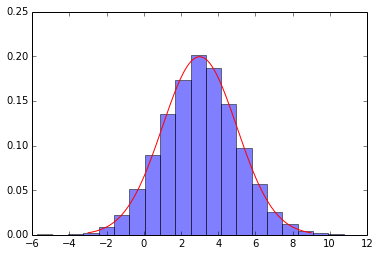
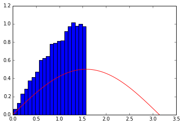
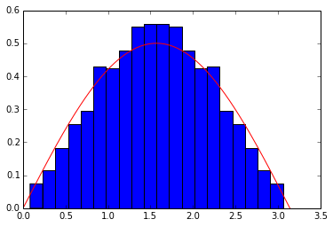
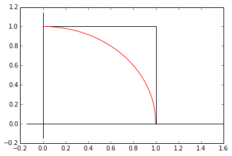
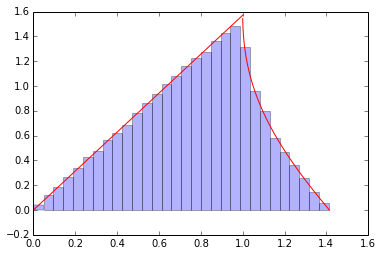

# Simulating Random Variables
If you want to simulate distributions, there are many built in functions.  For instance if I want to sample from the normal distribution with $\mu=3$ and $\sigma=2$:


```python
%pylab inline
from numpy.random import normal
print "\n\nI am a random sample of a normal distribution: %f" % normal(3,2)
```

    Populating the interactive namespace from numpy and matplotlib
    
    
    I am a random sample of a normal distribution: 5.020229


And if I want to see how this fares with my idea of the distribution
$$ f(x) = \frac{1}{\sqrt{2 \pi \sigma^2}}e^{-\frac{(x-\mu)^2}{2\sigma^2}}$$


```python
# A normed histogram of 10,000 samples - this should approximate the density
samples = normal(3, 2, size=10000)
hist(samples, bins=20, normed=True, alpha=0.5)

# The graph of the curve
X = linspace(-3, 9, 1000)
Y = 1/sqrt(2*pi*4)*exp(-(X-3)**2/8)
plot(X, Y, 'r-')
```


    [<matplotlib.lines.Line2D at 0x108354810>]





But suppose we have a distribution that doesn't have a built in function.  For example:
$$ f(x) = \frac{1}{2} \sin{x} \;\;\; 0 \leq x \leq \pi , \;\;\;\;\; 0 \textrm{ otherwise} $$
And we want to sample from this distribution.

In general we take the cdf.  The cdf has a range from 0 to one (perhaps inclusive), and is non-decreasing.  If we sample from a standard uniform distribution, and then the pre-image, we can simulate the random variable.  If the cdf is strictly increasing, this is just the inverse, and:
$$ X \sim F_X^{-1}(U) $$

In our case,
$$ F_X(x) = \int_0^x \frac{\sin t}{2} dt = \frac{1 - \cos x}{2} $$
So, naively we might try:
$$ \arccos(1-2U) $$


```python
def new_distribution(size=1):
    return arccos(1 - uniform(size=size))
```


```python
new_samples = new_distribution(10000)
hist(new_samples, bins=20, normed=True)

X = linspace(0, pi, 1000)
Y = sin(X)/2
plot(X, Y, 'r-')
```


    [<matplotlib.lines.Line2D at 0x1086173d0>]





It looks like we forgot to take into account the domain and range of inverse cosine.  When we are starting off we can use analytic and computer methods not only to solve problems, but to check ourselves.


```python
def new_distribution2(size=1):
    x = arccos(1 - uniform(size=size/2))
    # y = binomial(1, 0.5, size=size)
    # return x*y + (pi-x)*(1-y)
    return concatenate([x, pi-x])

new_samples2 = new_distribution2(1000)
hist(new_samples2, bins=20, normed=True)

X = linspace(0, pi, 10000)
Y = sin(X)/2
plot(X, Y, 'r-')
```


    [<matplotlib.lines.Line2D at 0x10846fc10>]





Note that this seems a lot rougher that the built in functions, because it is.  You can get weird behavior for a distribution with long tails (Why?  Think of the limitions of the computer as well as the method)

#Exercise 2.14 revisited
Let's consider exercise 2.14 with a twist.  Let's suppose are uniform iids, $X,Y \sim \textrm{Uniform}(0,1)$.  Let $R = \sqrt{X^2+Y^2}$.  What are the cdf and pdf of $R$?

We have two regions, one where $0 \leq R \leq 1$ and one where $1 < R \leq \sqrt{2} $.  The joint distribution is the product of the marginal distributions (since these are iids), so $ f_{X,Y}(x,y) = 1$


```python
X = linspace(0, 1, 100)
Y = sqrt(1 - X**2)
plot (X, Y, 'r-')

hlines(1, 0, 1)
hlines(0, -0.15, 1.6)
vlines(1, 0, 1)
vlines(0, -0.15, 1.15)

```


    <matplotlib.collections.LineCollection at 0x108fca990>





So the cdf is:
$$
F_R(r) = \left\{
     \begin{array}{lr}
       0 & r < 0\\
       \frac{\pi r^2}{4} & 0 \leq r \leq 1\\
       \sqrt{r^2-1} +  \frac{r^2}{2}\left[\frac{\pi}{2} - 2\arctan{(\sqrt{r^2-1})}\right] & 1 < r \leq \sqrt{2}\\
       1 & r > \sqrt{2}
     \end{array}
   \right.
$$
And the pdf is:
$$
f_R(r) = \left\{
     \begin{array}{lr}
       \frac{\pi r}{2} & 0 \leq r \leq 1\\
       \frac{\pi r}{2} - 2r\arctan{(\sqrt{r^2-1})} & 1 < r \leq \sqrt{2}\\
       0 & otherwise
     \end{array}
   \right.
$$

But this looks complicated; I would like to be confident that I have derived the correct equations.  So let's use random sampling to verify our answer, i.e. Monte Carlo http://en.wikipedia.org/wiki/Monte_Carlo_method

I am going to generate samples from $X$ and $Y$ and construct $R$.  I could then either compute the cdf by computing the percentage of points in each region for a given $r$, or use a normed histogram to approximate the pdf.


```python
# The Monte Carlo simulation
X = uniform(0, 1, 100000)
Y = uniform(0, 1, 100000)
R = sqrt(X**2 + Y**2)
hist(R, bins=30, normed=True, alpha=0.3)

# The equations I derived, graphed as red curves
X1 = linspace(0, 1, 1000)
X2 = linspace(1.0001, sqrt(2), 1000) #1.0001 to avoid potential divide by 0 errors
Y1 = pi*X1/2
S = sqrt(X2**2-1)
Y2 = X2*pi/2 - 2*X2*arctan(S)
plot(X1, Y1, 'r-')
plot(X2, Y2, 'r-')
```


    [<matplotlib.lines.Line2D at 0x108ff39d0>]





Looks pretty good.


```python

```
