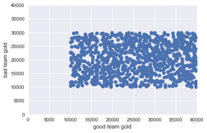
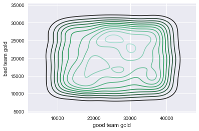
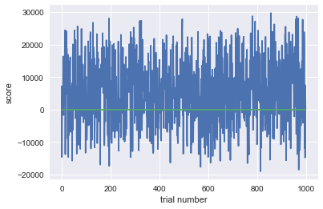
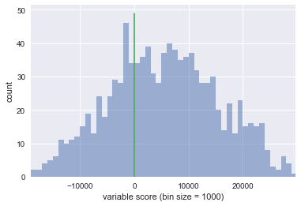
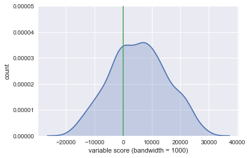

```python
import random
import matplotlib.pyplot as plt
import seaborn as sns
import numpy as np
%matplotlib inline


good_teams = random.sample(range(10000,40000),1000)
bad_teams = random.sample(range(10000,30000),1000)
x = np.arange(0, 40001, 1)
y = np.arange(0, 40001, 1)

score = [x1 - x2 for (x1, x2) in zip(good_teams, bad_teams)]
good_wins = sum(x > 0 for x in score)
bad_wins = sum(x < 0 for x in score)
print('Total good team wins:{}'.format(good_wins))
print('Total bad team wins:{}'.format(bad_wins))
print('biggest good team win:{}'.format(max(score)))
print('biggest bad team win:{}'.format(min(score)*float(-1)))

plt.scatter(x=good_teams,y=bad_teams)
plt.xlim(0,40000)
plt.ylim(0,40000)
plt.xlabel('good team gold')
plt.ylabel('bad team gold')
plt.show()
sns.kdeplot(np.array(good_teams),np.array(bad_teams))
plt.xlabel('good team gold')
plt.ylabel('bad team gold')
plt.show()
```

    Total good team wins:687
    Total bad team wins:313
    biggest good team win:29703
    biggest bad team win:18993.0








```python
x = np.zeros(len(score))
plt.plot(score)
plt.plot(x)
plt.xlabel('trial number')
plt.ylabel('score')
plt.show()
```





```python
x = np.zeros(50)
y = np.arange(0,50,1)

bins = np.arange(-30000, 31000, 1000) # fixed bin size
plt.xlim([min(score)-5, max(score)+5])
plt.hist(score, bins=bins, alpha=0.5)
plt.xlabel('variable score (bin size = 1000)')
plt.ylabel('count')
plt.plot(x,y)
plt.show()


sns.kdeplot(np.array(score),gridsize=1000,shade=True)
plt.ylim(0,0.00005)
plt.plot(x,y)
plt.xlabel('variable score (bandwidth = 1000)')
plt.ylabel('count')
plt.show()
```








```python

```
