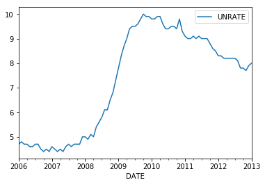
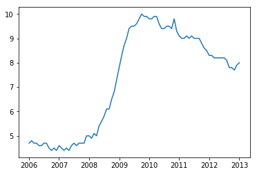
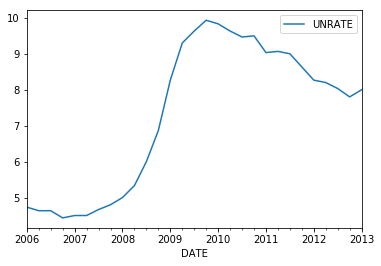
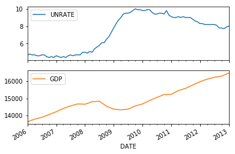

Pandas Basics
--
1. What Is Pandas?
--
 Pandas is a Python library designed for fast, efficient data analysis.
 Think of Pandas as a wrapper for numpy array which is very efficient for:

- Reading in data
- Manipulating Rows and Columns
- Adjusting indices
- Working with dates and time series
- Sorting, grouping, re-ordering and general data munging (cleaning)


1.1 Series
---

 The simplest pandas data type is a series.


```python
import pandas as pd
import numpy as np
```


```python
s = pd.Series(np.random.rand(5))
s
```


    0    0.984108
    1    0.870492
    2    0.745334
    3    0.714160
    4    0.546910
    dtype: float64


- A series is a one-dimensional labeled array capable of holding any data type.
- Made up of a one-dimensional array of data and an one-dimensional index.

1.2 Accessing Elements
---
- Elements can be accessed using the standad [ ] notation


```python
s[0:]
```


    0    0.984108
    1    0.870492
    2    0.745334
    3    0.714160
    4    0.546910
    dtype: float64


```python
s[3:]
```


    3    0.71416
    4    0.54691
    dtype: float64


```python
s[:3]
```


    0    0.984108
    1    0.870492
    2    0.745334
    dtype: float64


```python
print(s[4])
```

    0.546910311474


- we can also re-index the series


```python
s.index = ['a','b','c','d','e']
s
```


    a    0.984108
    b    0.870492
    c    0.745334
    d    0.714160
    e    0.546910
    dtype: float64


```python
print(s['c'],s[2])
```

    0.745333500002 0.745333500002


1.3 Manipulating Series
---
- There are a myriad of options for manipulating series, here are a few examples


```python
s.describe()
```


    count    5.000000
    mean     0.772201
    std      0.165387
    min      0.546910
    25%      0.714160
    50%      0.745334
    75%      0.870492
    max      0.984108
    dtype: float64


- There are also dot commands to apply functions across your series
- Dot command functions can be viewed by placing a period after the data object and then pressing 'Tab'


```python
np.exp(s)
```


    a    2.675424
    b    2.388085
    c    2.107144
    d    2.042471
    e    1.727906
    dtype: float64


```python
s.sort()
s
```

    /Library/Frameworks/Python.framework/Versions/3.5/lib/python3.5/site-packages/ipykernel/__main__.py:1: FutureWarning: sort is deprecated, use sort_values(inplace=True) for INPLACE sorting
      if __name__ == '__main__':


    e    0.546910
    d    0.714160
    c    0.745334
    b    0.870492
    a    0.984108
    dtype: float64


1.4 Time Series
---
- We've seen that an index of a series can really be any list we want. What about dates?


```python
pd.date_range?
```


```python
s.index = pd.date_range('02/01/2013', periods=5, freq ='AS')
s
```


    2014-01-01    0.546910
    2015-01-01    0.714160
    2016-01-01    0.745334
    2017-01-01    0.870492
    2018-01-01    0.984108
    Freq: AS-JAN, dtype: float64


- Working with Dates and Times can get a little complicated refer to http://pandas.pydata.org/pandas-docs/stable/timeseries.html for more examples

- Pandas also allows us to access data from Fred, Yahoo! Finance, Google Finance,  and Fama-French
- Keep in mind you will need to know the indicator code that you are searching for


```python
import pandas_datareader as web
unrate = web.DataReader('UNRATE', 'fred', '01/01/2006', '01/01/2013')
unrate.head(5)
```


<div>
<table border="1" class="dataframe">
  <thead>
    <tr style="text-align: right;">
      <th></th>
      <th>UNRATE</th>
    </tr>
    <tr>
      <th>DATE</th>
      <th></th>
    </tr>
  </thead>
  <tbody>
    <tr>
      <th>2006-01-01</th>
      <td>4.7</td>
    </tr>
    <tr>
      <th>2006-02-01</th>
      <td>4.8</td>
    </tr>
    <tr>
      <th>2006-03-01</th>
      <td>4.7</td>
    </tr>
    <tr>
      <th>2006-04-01</th>
      <td>4.7</td>
    </tr>
    <tr>
      <th>2006-05-01</th>
      <td>4.6</td>
    </tr>
  </tbody>
</table>
</div>


1.5 Basic Time Series Plots
--


```python
import matplotlib.pyplot as plt
%matplotlib inline

unrate.plot()
```


    <matplotlib.axes._subplots.AxesSubplot at 0x1085333c8>





```python
plt.plot(unrate)
```


    [<matplotlib.lines.Line2D at 0x1086e6908>]





1.6 Resampling
---
- A nice feature of pandas time series is the ability to resample the time series
- Currently the unemployement rate data is monthly.
- Transforming it into quarterly data is easy
- There are also many ways to do this, pandas gives you several options


```python
unrate_q = unrate.resample('Q') 
unrate_q.head(5)
```

    /Library/Frameworks/Python.framework/Versions/3.5/lib/python3.5/site-packages/ipykernel/__main__.py:2: FutureWarning: 
    .resample() is now a deferred operation
    You called head(...) on this deferred object which materialized it into a dataframe
    by implicitly taking the mean.  Use .resample(...).mean() instead
      from ipykernel import kernelapp as app


<div>
<table border="1" class="dataframe">
  <thead>
    <tr style="text-align: right;">
      <th></th>
      <th>UNRATE</th>
    </tr>
    <tr>
      <th>DATE</th>
      <th></th>
    </tr>
  </thead>
  <tbody>
    <tr>
      <th>2006-03-31</th>
      <td>4.733333</td>
    </tr>
    <tr>
      <th>2006-06-30</th>
      <td>4.633333</td>
    </tr>
    <tr>
      <th>2006-09-30</th>
      <td>4.633333</td>
    </tr>
    <tr>
      <th>2006-12-31</th>
      <td>4.433333</td>
    </tr>
    <tr>
      <th>2007-03-31</th>
      <td>4.500000</td>
    </tr>
  </tbody>
</table>
</div>


```python
unrate_q.plot()
```

    /Library/Frameworks/Python.framework/Versions/3.5/lib/python3.5/site-packages/ipykernel/__main__.py:1: FutureWarning: 
    .resample() is now a deferred operation
    You called plot(...) on this deferred object which materialized it into a dataframe
    by implicitly taking the mean.  Use .resample(...).mean() instead
      if __name__ == '__main__':


    <matplotlib.axes._subplots.AxesSubplot at 0x108660940>





2. Data Frames
---
- Most comonly used object in pandas is a data frame
- Think of the data fame as a 2-dimensional array with lables for both the columns and the rows
- Alternatively as a dictionary of Series


```python
df = pd.DataFrame(np.random.rand(6,4),columns = ['A','B','C','D'])
df
```


<div>
<table border="1" class="dataframe">
  <thead>
    <tr style="text-align: right;">
      <th></th>
      <th>A</th>
      <th>B</th>
      <th>C</th>
      <th>D</th>
    </tr>
  </thead>
  <tbody>
    <tr>
      <th>0</th>
      <td>0.182657</td>
      <td>0.979352</td>
      <td>0.923377</td>
      <td>0.923997</td>
    </tr>
    <tr>
      <th>1</th>
      <td>0.821698</td>
      <td>0.248347</td>
      <td>0.307459</td>
      <td>0.382108</td>
    </tr>
    <tr>
      <th>2</th>
      <td>0.967982</td>
      <td>0.343090</td>
      <td>0.996763</td>
      <td>0.966951</td>
    </tr>
    <tr>
      <th>3</th>
      <td>0.368450</td>
      <td>0.890287</td>
      <td>0.939832</td>
      <td>0.769089</td>
    </tr>
    <tr>
      <th>4</th>
      <td>0.647109</td>
      <td>0.030413</td>
      <td>0.800760</td>
      <td>0.724243</td>
    </tr>
    <tr>
      <th>5</th>
      <td>0.899049</td>
      <td>0.112109</td>
      <td>0.123623</td>
      <td>0.933738</td>
    </tr>
  </tbody>
</table>
</div>


2.1 Accessing Elements
---
- Element access is very similar to series and numpy arrays


```python
df[0:2]
```


<div>
<table border="1" class="dataframe">
  <thead>
    <tr style="text-align: right;">
      <th></th>
      <th>A</th>
      <th>B</th>
      <th>C</th>
      <th>D</th>
    </tr>
  </thead>
  <tbody>
    <tr>
      <th>0</th>
      <td>0.182657</td>
      <td>0.979352</td>
      <td>0.923377</td>
      <td>0.923997</td>
    </tr>
    <tr>
      <th>1</th>
      <td>0.821698</td>
      <td>0.248347</td>
      <td>0.307459</td>
      <td>0.382108</td>
    </tr>
  </tbody>
</table>
</div>


```python
df['A'] #this returns a series!
```


    0    0.182657
    1    0.821698
    2    0.967982
    3    0.368450
    4    0.647109
    5    0.899049
    Name: A, dtype: float64


```python
df.A
```


    0    0.182657
    1    0.821698
    2    0.967982
    3    0.368450
    4    0.647109
    5    0.899049
    Name: A, dtype: float64


```python
df.A[0] = 'NaN'
df.head(3)
```


<div>
<table border="1" class="dataframe">
  <thead>
    <tr style="text-align: right;">
      <th></th>
      <th>A</th>
      <th>B</th>
      <th>C</th>
      <th>D</th>
    </tr>
  </thead>
  <tbody>
    <tr>
      <th>0</th>
      <td>NaN</td>
      <td>0.979352</td>
      <td>0.923377</td>
      <td>0.923997</td>
    </tr>
    <tr>
      <th>1</th>
      <td>0.821698</td>
      <td>0.248347</td>
      <td>0.307459</td>
      <td>0.382108</td>
    </tr>
    <tr>
      <th>2</th>
      <td>0.967982</td>
      <td>0.343090</td>
      <td>0.996763</td>
      <td>0.966951</td>
    </tr>
  </tbody>
</table>
</div>


2.2 Modifying Data
---
- As with series we can apply functions to data frames


```python
np.exp(df[['A','B','D']])
```


<div>
<table border="1" class="dataframe">
  <thead>
    <tr style="text-align: right;">
      <th></th>
      <th>A</th>
      <th>B</th>
      <th>D</th>
    </tr>
  </thead>
  <tbody>
    <tr>
      <th>0</th>
      <td>NaN</td>
      <td>2.662731</td>
      <td>2.519340</td>
    </tr>
    <tr>
      <th>1</th>
      <td>2.274358</td>
      <td>1.281905</td>
      <td>1.465371</td>
    </tr>
    <tr>
      <th>2</th>
      <td>2.632626</td>
      <td>1.409296</td>
      <td>2.629913</td>
    </tr>
    <tr>
      <th>3</th>
      <td>1.445492</td>
      <td>2.435829</td>
      <td>2.157799</td>
    </tr>
    <tr>
      <th>4</th>
      <td>1.910011</td>
      <td>1.030880</td>
      <td>2.063168</td>
    </tr>
    <tr>
      <th>5</th>
      <td>2.457265</td>
      <td>1.118634</td>
      <td>2.544001</td>
    </tr>
  </tbody>
</table>
</div>


- Or we can describe the data


```python
df.describe()
```


<div>
<table border="1" class="dataframe">
  <thead>
    <tr style="text-align: right;">
      <th></th>
      <th>A</th>
      <th>B</th>
      <th>C</th>
      <th>D</th>
    </tr>
  </thead>
  <tbody>
    <tr>
      <th>count</th>
      <td>5.000000</td>
      <td>6.000000</td>
      <td>6.000000</td>
      <td>6.000000</td>
    </tr>
    <tr>
      <th>mean</th>
      <td>0.740858</td>
      <td>0.433933</td>
      <td>0.681969</td>
      <td>0.783354</td>
    </tr>
    <tr>
      <th>std</th>
      <td>0.240115</td>
      <td>0.403692</td>
      <td>0.371480</td>
      <td>0.219454</td>
    </tr>
    <tr>
      <th>min</th>
      <td>0.368450</td>
      <td>0.030413</td>
      <td>0.123623</td>
      <td>0.382108</td>
    </tr>
    <tr>
      <th>25%</th>
      <td>0.647109</td>
      <td>0.146168</td>
      <td>0.430785</td>
      <td>0.735454</td>
    </tr>
    <tr>
      <th>50%</th>
      <td>0.821698</td>
      <td>0.295719</td>
      <td>0.862068</td>
      <td>0.846543</td>
    </tr>
    <tr>
      <th>75%</th>
      <td>0.899049</td>
      <td>0.753488</td>
      <td>0.935718</td>
      <td>0.931303</td>
    </tr>
    <tr>
      <th>max</th>
      <td>0.967982</td>
      <td>0.979352</td>
      <td>0.996763</td>
      <td>0.966951</td>
    </tr>
  </tbody>
</table>
</div>


2.3 Boolean Indexing
---
- Another cool thing about pandas is the ability to index elements with booleans
- A natural question to ask is, "What on earth is a boolean?"
- Booleans are very simple variables that can be in only one of 2 states: True and False


```python
y = 100 < 10 
print(y)
```

    False


```python
df[df.A > 0.5]
```


<div>
<table border="1" class="dataframe">
  <thead>
    <tr style="text-align: right;">
      <th></th>
      <th>A</th>
      <th>B</th>
      <th>C</th>
      <th>D</th>
    </tr>
  </thead>
  <tbody>
    <tr>
      <th>1</th>
      <td>0.821698</td>
      <td>0.248347</td>
      <td>0.307459</td>
      <td>0.382108</td>
    </tr>
    <tr>
      <th>2</th>
      <td>0.967982</td>
      <td>0.343090</td>
      <td>0.996763</td>
      <td>0.966951</td>
    </tr>
    <tr>
      <th>4</th>
      <td>0.647109</td>
      <td>0.030413</td>
      <td>0.800760</td>
      <td>0.724243</td>
    </tr>
    <tr>
      <th>5</th>
      <td>0.899049</td>
      <td>0.112109</td>
      <td>0.123623</td>
      <td>0.933738</td>
    </tr>
  </tbody>
</table>
</div>


```python
df[df > 0.8] = 1
df
```


<div>
<table border="1" class="dataframe">
  <thead>
    <tr style="text-align: right;">
      <th></th>
      <th>A</th>
      <th>B</th>
      <th>C</th>
      <th>D</th>
    </tr>
  </thead>
  <tbody>
    <tr>
      <th>0</th>
      <td>NaN</td>
      <td>1.000000</td>
      <td>1.000000</td>
      <td>1.000000</td>
    </tr>
    <tr>
      <th>1</th>
      <td>1.000000</td>
      <td>0.248347</td>
      <td>0.307459</td>
      <td>0.382108</td>
    </tr>
    <tr>
      <th>2</th>
      <td>1.000000</td>
      <td>0.343090</td>
      <td>1.000000</td>
      <td>1.000000</td>
    </tr>
    <tr>
      <th>3</th>
      <td>0.368450</td>
      <td>1.000000</td>
      <td>1.000000</td>
      <td>0.769089</td>
    </tr>
    <tr>
      <th>4</th>
      <td>0.647109</td>
      <td>0.030413</td>
      <td>1.000000</td>
      <td>0.724243</td>
    </tr>
    <tr>
      <th>5</th>
      <td>1.000000</td>
      <td>0.112109</td>
      <td>0.123623</td>
      <td>1.000000</td>
    </tr>
  </tbody>
</table>
</div>


2.4 Grouping
-- 
- Grouping is a way of grouping results by values and performing analysis on those groups


```python
df['gender'] = [1,1,2,1,2,1]
df
```


<div>
<table border="1" class="dataframe">
  <thead>
    <tr style="text-align: right;">
      <th></th>
      <th>A</th>
      <th>B</th>
      <th>C</th>
      <th>D</th>
      <th>gender</th>
    </tr>
  </thead>
  <tbody>
    <tr>
      <th>0</th>
      <td>NaN</td>
      <td>1.000000</td>
      <td>1.000000</td>
      <td>1.000000</td>
      <td>1</td>
    </tr>
    <tr>
      <th>1</th>
      <td>1.000000</td>
      <td>0.248347</td>
      <td>0.307459</td>
      <td>0.382108</td>
      <td>1</td>
    </tr>
    <tr>
      <th>2</th>
      <td>1.000000</td>
      <td>0.343090</td>
      <td>1.000000</td>
      <td>1.000000</td>
      <td>2</td>
    </tr>
    <tr>
      <th>3</th>
      <td>0.368450</td>
      <td>1.000000</td>
      <td>1.000000</td>
      <td>0.769089</td>
      <td>1</td>
    </tr>
    <tr>
      <th>4</th>
      <td>0.647109</td>
      <td>0.030413</td>
      <td>1.000000</td>
      <td>0.724243</td>
      <td>2</td>
    </tr>
    <tr>
      <th>5</th>
      <td>1.000000</td>
      <td>0.112109</td>
      <td>0.123623</td>
      <td>1.000000</td>
      <td>1</td>
    </tr>
  </tbody>
</table>
</div>


```python
df.groupby('gender').sum()
```


<div>
<table border="1" class="dataframe">
  <thead>
    <tr style="text-align: right;">
      <th></th>
      <th>A</th>
      <th>B</th>
      <th>C</th>
      <th>D</th>
    </tr>
    <tr>
      <th>gender</th>
      <th></th>
      <th></th>
      <th></th>
      <th></th>
    </tr>
  </thead>
  <tbody>
    <tr>
      <th>1</th>
      <td>2.368450</td>
      <td>2.360456</td>
      <td>2.431082</td>
      <td>3.151197</td>
    </tr>
    <tr>
      <th>2</th>
      <td>1.647109</td>
      <td>0.373504</td>
      <td>2.000000</td>
      <td>1.724243</td>
    </tr>
  </tbody>
</table>
</div>


```python
df.groupby('gender').describe()
```


<div>
<table border="1" class="dataframe">
  <thead>
    <tr style="text-align: right;">
      <th></th>
      <th></th>
      <th>A</th>
      <th>B</th>
      <th>C</th>
      <th>D</th>
    </tr>
    <tr>
      <th>gender</th>
      <th></th>
      <th></th>
      <th></th>
      <th></th>
      <th></th>
    </tr>
  </thead>
  <tbody>
    <tr>
      <th rowspan="8" valign="top">1</th>
      <th>count</th>
      <td>3.000000</td>
      <td>4.000000</td>
      <td>4.000000</td>
      <td>4.000000</td>
    </tr>
    <tr>
      <th>mean</th>
      <td>0.789483</td>
      <td>0.590114</td>
      <td>0.607771</td>
      <td>0.787799</td>
    </tr>
    <tr>
      <th>std</th>
      <td>0.364626</td>
      <td>0.476553</td>
      <td>0.459084</td>
      <td>0.291544</td>
    </tr>
    <tr>
      <th>min</th>
      <td>0.368450</td>
      <td>0.112109</td>
      <td>0.123623</td>
      <td>0.382108</td>
    </tr>
    <tr>
      <th>25%</th>
      <td>0.684225</td>
      <td>0.214287</td>
      <td>0.261500</td>
      <td>0.672344</td>
    </tr>
    <tr>
      <th>50%</th>
      <td>1.000000</td>
      <td>0.624173</td>
      <td>0.653730</td>
      <td>0.884544</td>
    </tr>
    <tr>
      <th>75%</th>
      <td>1.000000</td>
      <td>1.000000</td>
      <td>1.000000</td>
      <td>1.000000</td>
    </tr>
    <tr>
      <th>max</th>
      <td>1.000000</td>
      <td>1.000000</td>
      <td>1.000000</td>
      <td>1.000000</td>
    </tr>
    <tr>
      <th rowspan="8" valign="top">2</th>
      <th>count</th>
      <td>2.000000</td>
      <td>2.000000</td>
      <td>2.000000</td>
      <td>2.000000</td>
    </tr>
    <tr>
      <th>mean</th>
      <td>0.823555</td>
      <td>0.186752</td>
      <td>1.000000</td>
      <td>0.862121</td>
    </tr>
    <tr>
      <th>std</th>
      <td>0.249532</td>
      <td>0.221096</td>
      <td>0.000000</td>
      <td>0.194990</td>
    </tr>
    <tr>
      <th>min</th>
      <td>0.647109</td>
      <td>0.030413</td>
      <td>1.000000</td>
      <td>0.724243</td>
    </tr>
    <tr>
      <th>25%</th>
      <td>0.735332</td>
      <td>0.108582</td>
      <td>1.000000</td>
      <td>0.793182</td>
    </tr>
    <tr>
      <th>50%</th>
      <td>0.823555</td>
      <td>0.186752</td>
      <td>1.000000</td>
      <td>0.862121</td>
    </tr>
    <tr>
      <th>75%</th>
      <td>0.911777</td>
      <td>0.264921</td>
      <td>1.000000</td>
      <td>0.931061</td>
    </tr>
    <tr>
      <th>max</th>
      <td>1.000000</td>
      <td>0.343090</td>
      <td>1.000000</td>
      <td>1.000000</td>
    </tr>
  </tbody>
</table>
</div>


2.5 Data Frames and Times Series
---
- Up to now we've been treating the index of a data frame as the sequence 0,1,2,. . .
- Could just as easily be a data range, which allows pandas to hold sequences of diferent sampling rates
- Recall the UNRATE sequence holds monthly data
- We can also obtain a GDP series from FRED


```python
gdp = web.DataReader('GDP', 'fred', '01/01/2006', '01/01/2013')
gdp.head(5)
```


<div>
<table border="1" class="dataframe">
  <thead>
    <tr style="text-align: right;">
      <th></th>
      <th>GDP</th>
    </tr>
    <tr>
      <th>DATE</th>
      <th></th>
    </tr>
  </thead>
  <tbody>
    <tr>
      <th>2006-01-01</th>
      <td>13648.9</td>
    </tr>
    <tr>
      <th>2006-04-01</th>
      <td>13799.8</td>
    </tr>
    <tr>
      <th>2006-07-01</th>
      <td>13908.5</td>
    </tr>
    <tr>
      <th>2006-10-01</th>
      <td>14066.4</td>
    </tr>
    <tr>
      <th>2007-01-01</th>
      <td>14233.2</td>
    </tr>
  </tbody>
</table>
</div>


- GDP is quarterly data but we can still easily create a data frame that holds both


```python
macro = unrate.join(gdp) #combines the two data frames using the index
macro.head(5)
```


<div>
<table border="1" class="dataframe">
  <thead>
    <tr style="text-align: right;">
      <th></th>
      <th>UNRATE</th>
      <th>GDP</th>
    </tr>
    <tr>
      <th>DATE</th>
      <th></th>
      <th></th>
    </tr>
  </thead>
  <tbody>
    <tr>
      <th>2006-01-01</th>
      <td>4.7</td>
      <td>13648.9</td>
    </tr>
    <tr>
      <th>2006-02-01</th>
      <td>4.8</td>
      <td>NaN</td>
    </tr>
    <tr>
      <th>2006-03-01</th>
      <td>4.7</td>
      <td>NaN</td>
    </tr>
    <tr>
      <th>2006-04-01</th>
      <td>4.7</td>
      <td>13799.8</td>
    </tr>
    <tr>
      <th>2006-05-01</th>
      <td>4.6</td>
      <td>NaN</td>
    </tr>
  </tbody>
</table>
</div>


- Why are there missing values for GDP?
- The dot command interpolate uses linear interpolation to fill in the missing values for gdp


```python
macro.interpolate().plot(subplots = True)
```


    array([<matplotlib.axes._subplots.AxesSubplot object at 0x10907cb70>,
           <matplotlib.axes._subplots.AxesSubplot object at 0x10925c2e8>], dtype=object)





Practice Makes Perfect!
--
Thank you!
---


```python

```
